# waph-koppulrh

# WAPH-Web Application Programming and Hacking

## Instructor: Dr. Phu Phung

## Student

**Name** Koppula Rohith
**Email**: koppulrh@mail.uc.edu

**Short-bio**:I am enthusiastic about learning web applications and ethical hacking since 
 I am new to this course.

## Repository Information

 My Respository's URL: [https://github.com/koppulrh/waph-koppulrh/tree/main](https://github.com/koppulrh/waph-koppulrh/tree/main)

 ## project Repository informatiin

 LINK: [https://github.com/koppulrh/koppulrh.github.io/tree/main](https://github.com/koppulrh/koppulrh.github.io/tree/main)

 ## Personal Web Page Link

 LINK: [https://koppulrh.github.io/projectrk.html](https://koppulrh.github.io/projectrk.html)

 **Project_1**

 **overview:**
 The name of the project is front-end web development on github.io cloud service with a professional profile website.

 In the project i have learned how to create a web page from the begnning, to create this web page i have used several exteranal sources and frameworks. i have also usd some previous labs content and implemented the concepts inthis project  i have recalled the classess of the previous tasks for this project. there were some new elements discussed like cookies and else so im going to explain that in the process.

 **Section_1**

 In this section i have created a web page that consist of my details education and exprience and contact information, in general i have created my resume in the webpage.

 with the help of open source bootstrap that has been suggested by the professor from w3 schools, i have created this webpage.

 i even added my portfolio for a specfic company called snowflake wether im eligable or not.

 i have inculued my image in the webpage.

 for the professor given website i have made changes and added about, targeted company, education, work exprience, contact info, projects, course link.

 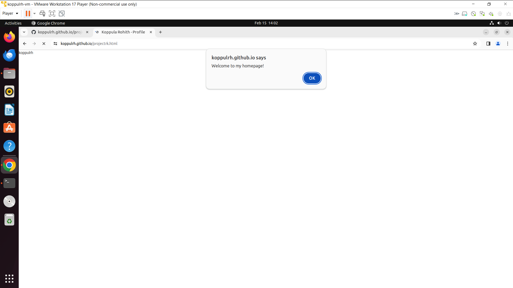

  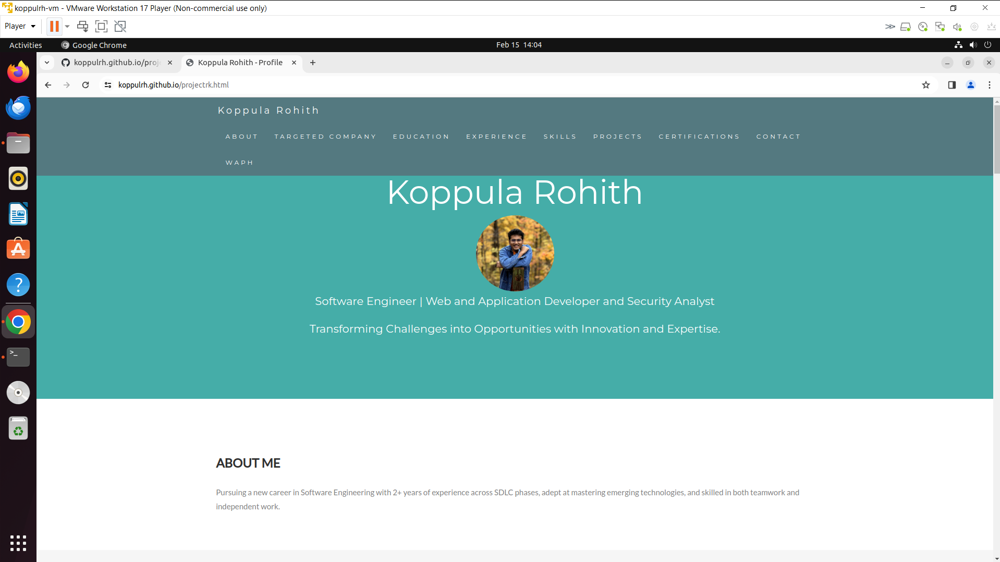

  **Section_2**
  
  In this section i have included a tracker with the helpm of google analytics, this tracker will help me threact the user viewership of the application. 

  for that i have created an analytics account and added to the source code of my html page.

  so as i have made several changes to the bootstrap page i have created my professional page and with the help nof this tracker i have checked the visitor count from my webpage.

   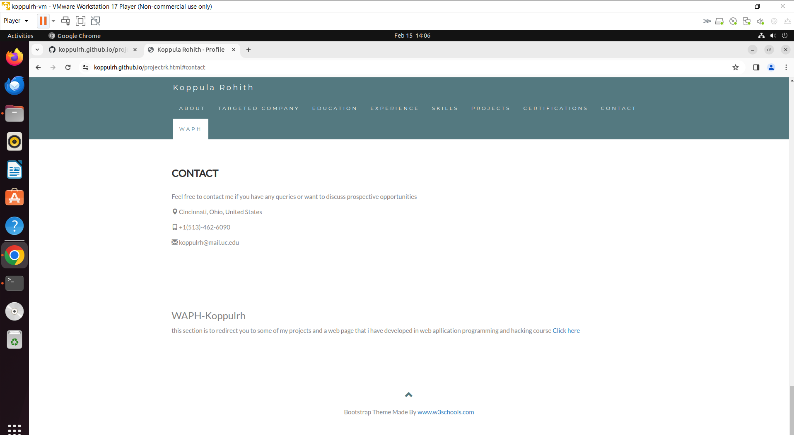

   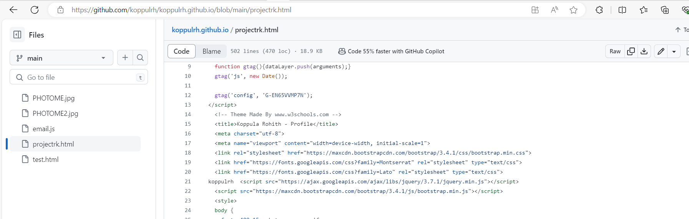

   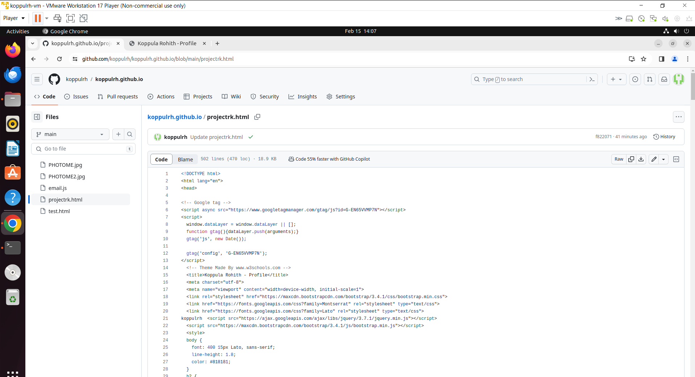

   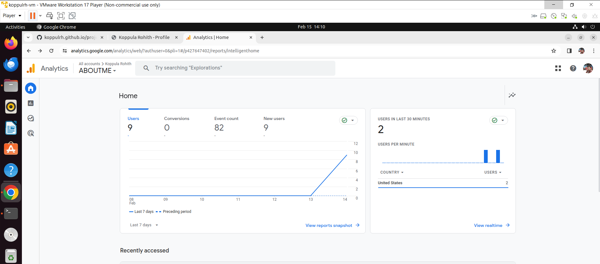

   **Section_3**

   For this section i have revisited the concepts of Lab1 and Lab2.

   i have implemented a jquery example and implemented in a new html page which will we opened when you clik on click here button in the waph section from the main page.

   for jquery i have added jokeapi function and guess age function.

   i have used angular to display a message.

   i have added digital clock to the webpage and included an anolog clock too.

   not only that but also i have included **a link that which redirect the page to the git hub as mentioned in the section 1** 

   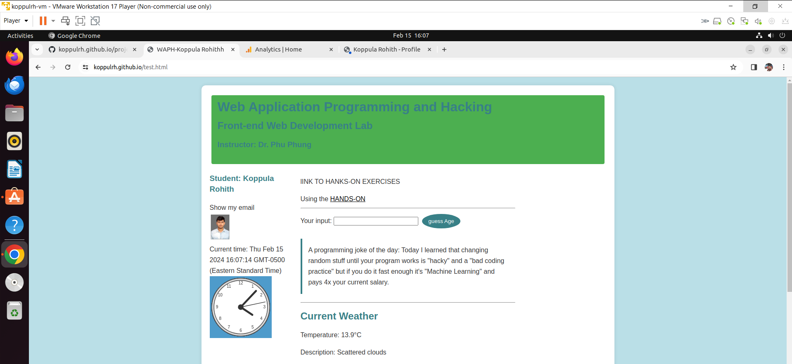

   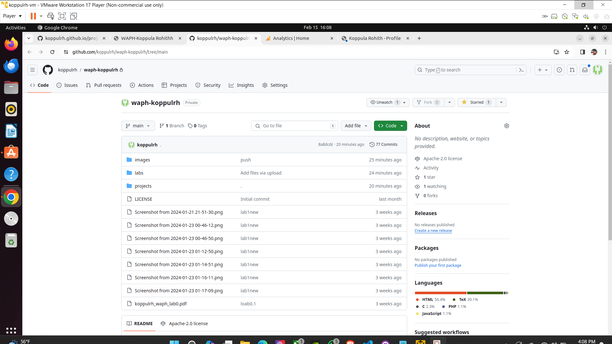
   
   
   later on for the joke api the joke will change for every one min.

   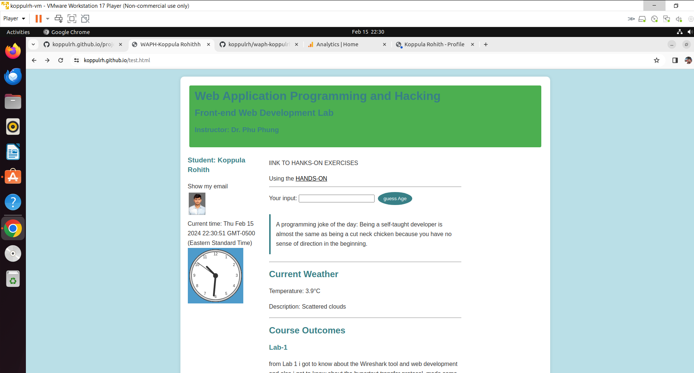

   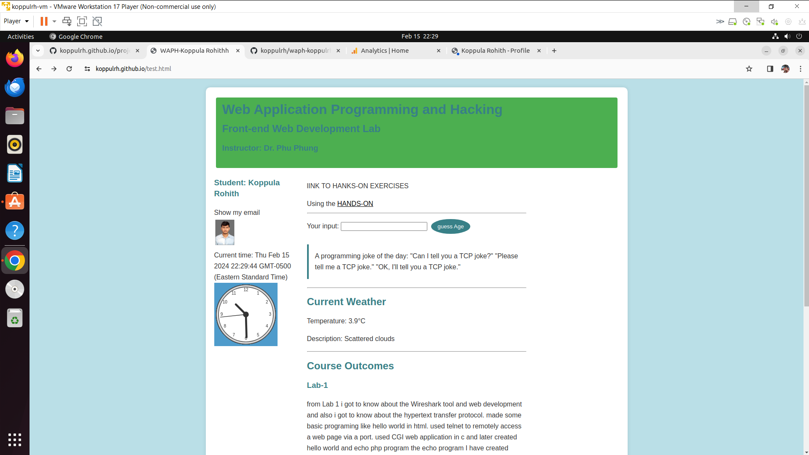

   for the graphic part i have created a weather forcast of cincinatti with the help of thsi weather api i have integrated into the html page and displaued temperature. 

   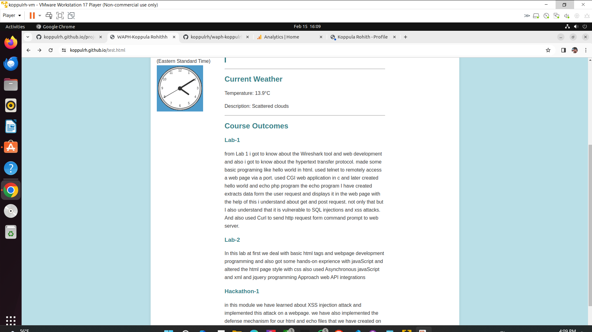
   

   Finally i have wrote a code to remmber the cookies of the site.

   with the help of the code provided by the professor i have implemented a aleart message that gives the time frame of the recent visit.

   in the begnning it says welcome. 

   if revisited it shows welcome back with the time and date.

   the data of the cookies is stored in the sub strip of javascript file.

   

   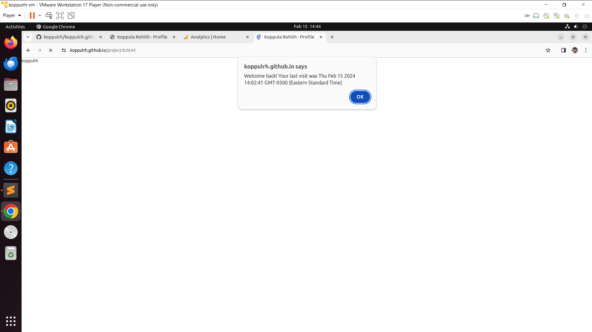
   
   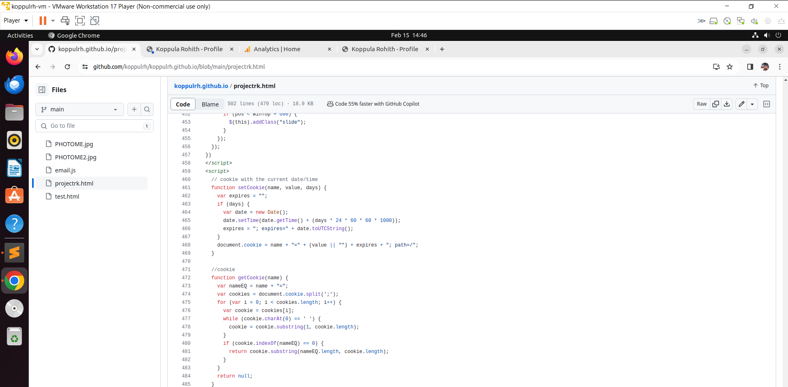

   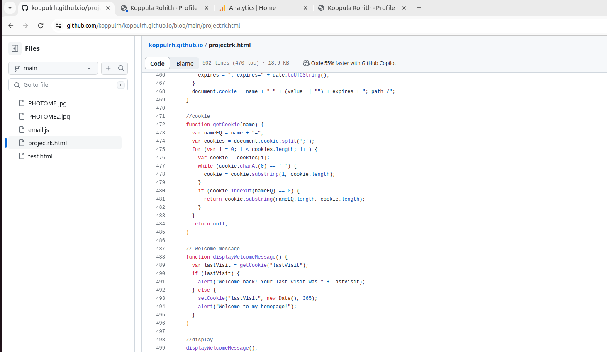

   

   
   
   

 

 

